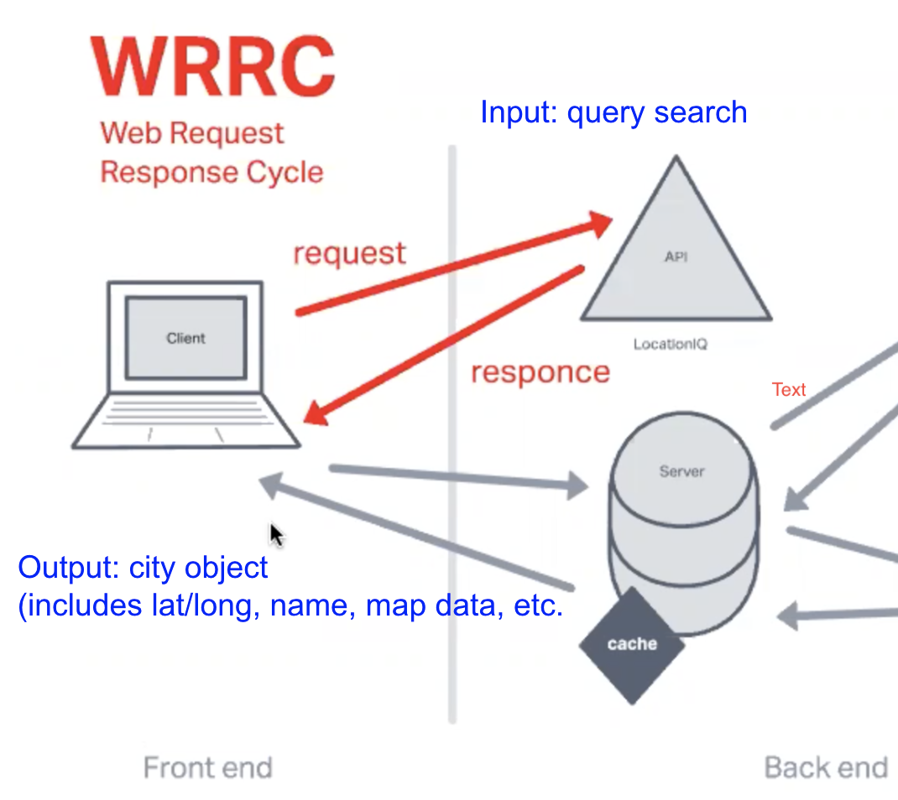

# City Explorer

**Author**: Jason Christopher  
**Version**: 1.0.4

## Overview

This app allows the user to input a city name and the LocationIQ API will select find a best match. That best match city will be displayed in a modal with a static Google map image of the city.

## Getting Started

The user only needs to type a city name in the input field and click the "Explore!" button to display the resulting city map.

## Architecture

The client inputs the name of the desired city. Then the app passes that query as a string to the locationIQ API that returns 10 matches. Only the best match is used and the latitude and longitude is passed again to the LocationIQ API to produce the static image of the city map and the city name is used in the modal header.

## Change Log

11-14-2022 7:21pm - Application now successfully calls the LocationIQ API to display the matching city name and map.

## Time Estimation

* Name of feature: Asynchronous code, and APIs
* Estimate of time needed to complete: 3 hours
* Start time: 3pm
* Finish time: 7pm
* Actual time needed to complete: 4 hours
